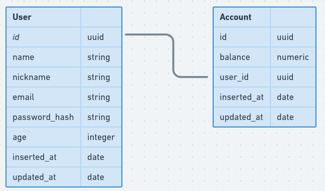

# Rocketpay API

[](https://codecov.io/gh/8bitbeard/elixir_rocketpay_api)

In this project, a digital account API was created with Elixir + Phoenix. This project was presented on the Next Level Week #4 from RocketSeat, as was improoved for study purpose.

Among the improovements, you will find:
- Changing the Authentication method from `Basic Auth` to a `JWT` based (Using the lib `Guardian`)
- Implementing a new Route to return the data of the logged in user
- Implementing the API documentation with Swagger (Using the lib `Phoenix_swagger`)
- Implementing more tests to reach 100% test coverage with `Excoveralls`
- Implementing a Factory to improove test readability (Using the lib `ExMachina`)
- Implementing a data randomization lib to improove tests (Using the lib `Faker`)
- Improoving the error handler

## Techs used
- [Elixir](https://elixir-lang.org/)
- [Phoenix Framework](https://www.phoenixframework.org/)
- [Guardian](https://hexdocs.pm/guardian/Guardian.html)
- [Phoenix_swagger](https://hexdocs.pm/phoenix_swagger/readme.html)
- [Excoveralls](https://hexdocs.pm/excoveralls/readme.html)
- [Faker](https://hexdocs.pm/faker/Faker.html)
- [ExMachina](https://hexdocs.pm/faker/Faker.html)
- [Bcrypt](https://hexdocs.pm/bcrypt_elixir/Bcrypt.html)
- [Codecov](https://about.codecov.io/)

## Installing dependencies and starting Phoenix server

  * Install dependencies with:
    ```shell
    $ mix deps.get
    ```
  * Create a PostgreSQL database on the default port `5432` (You can change the port on the `config/config.exs` file if needed)
    * You can use `Docker` (which i recommend) to create the database. Just run the following command:
      ```shell
      $ docker run --name rocketpay -e POSTGRES_PASSWORD=postgres -p 5432:5432 -d postgres
      ```
  * Setup and migrate your database with:
    ```shell
    mix ecto.setup
    ```
  * Start Phoenix endpoint with:
    ```shell
    $ mix phx.server

    #or inside IEx with
    $ iex -S mix phx.server
    ```

Now you can visit [`localhost:4000`](http://localhost:4000) from your browser.

To check the Swagger Documentation, you can visit the route [`/api/swagger`](http://localhost:4000/api/swagger).

# Database diagram



## Learn more about Phoenix Framework

  * Official website: https://www.phoenixframework.org/
  * Guides: https://hexdocs.pm/phoenix/overview.html
  * Docs: https://hexdocs.pm/phoenix
  * Forum: https://elixirforum.com/c/phoenix-forum
  * Source: https://github.com/phoenixframework/phoenix
